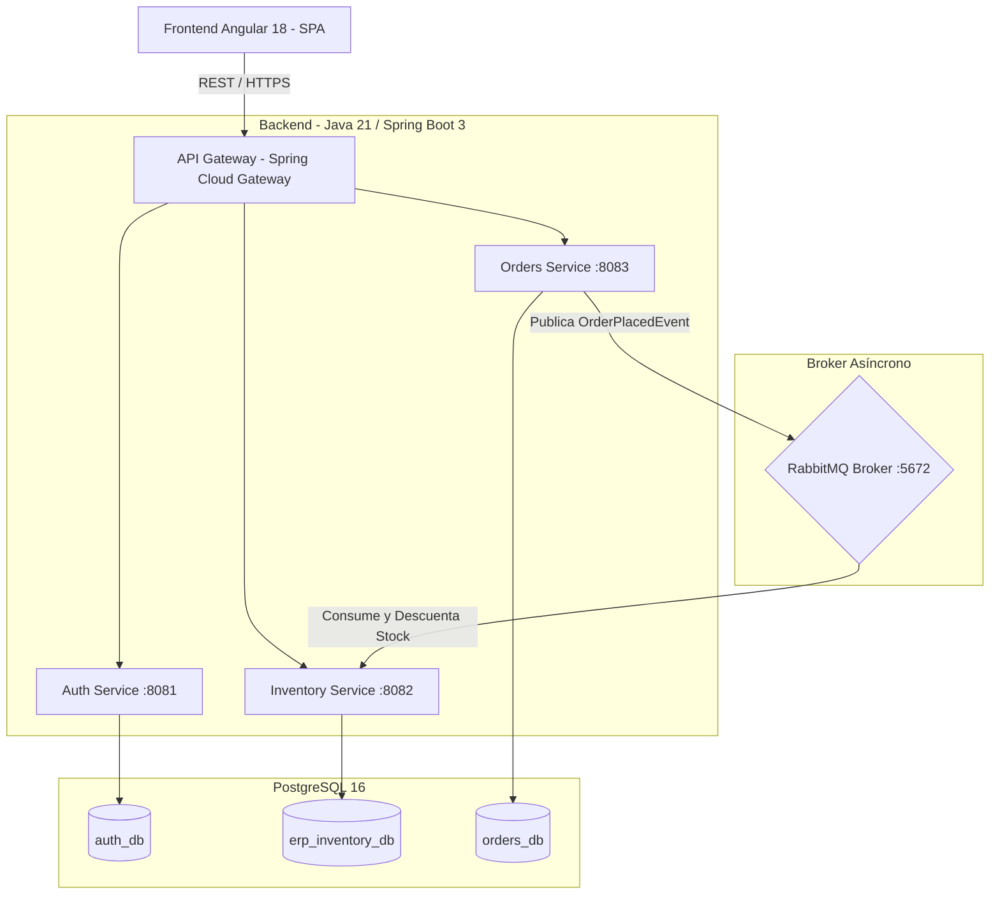

# 🏢 ERP Cloud Enterprise - Arquitectura de Microservicios

[](https://openjdk.org/)
[](https://spring.io/projects/spring-boot)
[](https://angular.dev/)
[](https://www.postgresql.org/)
[](https://www.rabbitmq.com/)
[](https://www.docker.com/)
[](https://kubernetes.io/)
[](https://azure.microsoft.com/)

Sistema de Planificación de Recursos Empresariales (**ERP**) desarrollado con arquitectura orientada a microservicios, eventos asíncronos y contenedores. Diseñado e implementado con las mejores prácticas de la industria: Clean Architecture, principio *Database-per-service*, contratos RESTful estandarizados (OpenAPI 3) y observabilidad de contenedores.

---

## 📐 Arquitectura General del Sistema



---

## 🗂️ Estructura del Proyecto (Monorepo)

```text
erp-system/
├── backend/
│   ├── inventory-service/      # Microservicio de inventario, stock y catálogo (Java 21)
│   ├── auth-service/           # Microservicio de seguridad y tokens JWT (Fase 2)
│   └── orders-service/         # Microservicio de pedidos y ventas (Fase 3)
├── frontend/
│   └── erp-web/                # Aplicación Web SPA en Angular 18 con Standalone Components
└── deploy/
    ├── docker/                 # Docker Compose para entorno local y producción
    ├── k8s/                    # Manifiestos de Kubernetes (Deployments, Services, ConfigMaps)
    └── azure/                  # Scripts y manifiestos para despliegue en Microsoft Azure
```

---

## 🚀 Estado de Implementación: Fase 1 (MVP 1 - Core & Inventario)

### Capacidades del MVP 1:
- [x] **Microservicio de Inventario (`inventory-service`)**:
  - CRUD completo para **Productos** y **Categorías** con validaciones Jakarta (`@Valid`).
  - Control de umbral de stock crítico (`minStockAlert`) con filtros inmediatos.
  - Registro inmutable de movimientos de almacén (`StockMovement`: Entradas, Salidas y Ajustes).
  - Cálculo de KPIs financieros y de almacén (`/api/v1/products/summary`).
  - Documentación Swagger UI integrada (`/swagger-ui.html`).
  - Manejador global de excepciones con respuestas estructuradas RFC.
  - Pruebas unitarias de servicios con JUnit 5 y Mockito.
  - Dockerfile multi-stage con imagen base Eclipse Temurin 21 JRE Alpine.
- [x] **Frontend Web (`erp-web`)**:
  - Panel de control con métricas en tiempo real (Total Productos, Stock Crítico, Unidades, Valorización).
  - Tabla de inventario responsiva con búsqueda por texto y SKU, filtrado por categorías y paginación.
  - Modales reactivos para creación/edición de productos y ajustes rápidos de stock.
  - Vistas de gestión de categorías y auditoría de movimientos.
- [x] **Infraestructura Local**:
  - `docker-compose.dev.yml` con PostgreSQL 16 y RabbitMQ 3.13 con consola de administración web.

---

## 🛠️ Guía Rápida para Levantar el MVP 1 en Local

### 1. Iniciar Base de Datos y Broker (Docker Desktop)
Desde una terminal en la raíz del proyecto:
```bash
cd deploy/docker
docker compose -f docker-compose.dev.yml up -d
```
* **PostgreSQL**: `localhost:5432` (Usuario: `erp_user`, Password: `erp_password`, DB: `erp_inventory_db`)
* **RabbitMQ Management**: `http://localhost:15672` (Usuario: `erp_rabbit`, Password: `rabbit_password`)

### 2. Iniciar el Microservicio de Inventario (Backend)
```bash
cd backend/inventory-service
mvn spring-boot:run
```
* **API REST**: `http://localhost:8082`
* **Swagger UI / Documentación**: `http://localhost:8082/swagger-ui.html`
* **Health Check**: `http://localhost:8082/actuator/health`

### 3. Iniciar el Frontend (Angular)
```bash
cd frontend/erp-web
npm install
npm start
```
* Abre tu navegador en: `http://localhost:4200`

---

## 🗺️ Roadmap de Fases Siguientes
- **Fase 2 (MVP 2)**: Seguridad centralizada con Spring Security 6, JWT, control de roles (`ADMIN`, `VENDEDOR`) y Spring Cloud API Gateway.
- **Fase 3 (MVP 3)**: Microservicio de órdenes de venta y comunicación desacoplada basada en eventos con RabbitMQ.
- **Fase 4 (MVP 4)**: Orquestación completa con Kubernetes (manifiestos de despliegue, ingress y límites de recursos).
- **Fase 5 (MVP 5)**: Despliegue en Microsoft Azure (Azure Container Apps / AKS + Azure Static Web Apps) y CI/CD con GitHub Actions.
